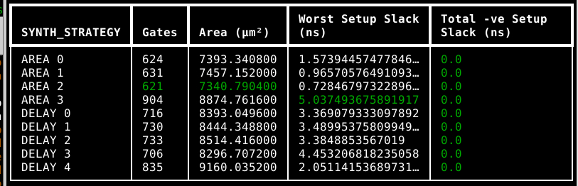

# Microdesafío 3 – Coprocesador bfloat16 con SPI  

Este proyecto implementa un coprocesador aritmético capaz de ejecutar operaciones en formato **bfloat16** utilizando una interfaz **SPI full-dúplex**. El sistema procesa instrucciones para suma/resta, multiplicación, división y operaciones acumulativas sobre un registro interno de 16 bits llamado **ACC**.

El chip recibe por MOSI una instrucción seguida de las palabras de datos necesarias. Dependiendo del comando, el sistema devuelve resultados inmediatos por MISO o actualiza el acumulador. Todas las operaciones se ejecutan empleando los módulos funcionales suministrados (`fp16sum_res_pipe`, `fpmul`, `fpdiv`).

---

## Arquitectura del coprocesador

El diseño integra un **datapath** compuesto por:

- **Acumulador de 16 bits (ACC)**: almacena resultados intermedios y operaciones acumulativas.  
- **Registros de entrada A y B**: capturan los operandos enviados por SPI.  
- **Módulos aritméticos**:  
  - `fp16sum_res_pipe`: suma y resta en bfloat16  
  - `fpmul`: multiplicación en bfloat16  
  - `fpdiv`: división en bfloat16  
- **Lógica de control**: interpreta instrucciones SPI, coordina la recepción de palabras y controla la ejecución de operaciones.  

---

## Funcionamiento general del módulo `bfloat16_processor`

1. **Interfaz SPI**:  
   - `sck`: reloj SPI  
   - `mosi`: datos del master hacia el esclavo  
   - `miso`: datos del esclavo hacia el master  
   - `cs`: chip select (activo bajo)  

2. **Recepción de instrucciones**:  
   - Se recibe primero la instrucción (16 bits) por MOSI.  
   - Según la instrucción, se leen uno o dos operandos.  
   - La máquina de estados interna controla este flujo:  
     - `state = 0`: esperando instrucción  
     - `state = 1`: esperando primer operando  
     - `state = 2`: esperando segundo operando  
     - `state = 3`: ejecutar operación  

3. **Ejecutar operaciones**:  
   - Las instrucciones soportadas incluyen:  
     - `ZERO`: limpia el acumulador  
     - `SET_ACC`: carga el acumulador  
     - `LOAD_ACC`: devuelve el acumulador  
     - `ADD2`, `SUB2`: suma/resta directa  
     - `MPY2`, `DIV2`: multiplicación/división  
     - `SUM`, `SUB`: operaciones acumulativas  
     - `MAC`, `MAS`: multiplicar y acumular/restar  
   - Los resultados se almacenan en `result_reg` y se devuelven por MISO.  

4. **Monitoreo y depuración**:  
   - `acc_monitor` permite ver el contenido actual del acumulador.  
   - `ready` indica si el coprocesador está listo para recibir la siguiente instrucción.  

5. **Notas sobre implementación**:  
   - Las operaciones de punto flotante están **simplificadas para pruebas funcionales**.  
   - La jerarquía está organizada con `bfloat16_processor` como módulo top.  
   - Todas las transferencias SPI son **LSB primero**.  

---

## Simulaciones realizadas

Se verificó para cada modulo su funcionamiento con Testbench para comprender su funcionamientos los aarchivos aparecen en el repositorio como .vcd se ejecutan con gtkwave archivo.vcd 

---

## Preparación para OpenLane

El proyecto se estructuró siguiendo la recomendación de OpenLane:

- Código fuente en Verilog  
- Archivos JSON de configuración para la síntesis  
- Archivos SDC con restricciones de tiempo  
- Reportes STA post-síntesis  
- Layout final generado por OpenLane  

---

### 2. Diagrama de bloques 

### 3. Cobertura de la especificación

- **Elementos cubiertos**:  
  - Recepción de instrucciones por SPI  
  - Ejecución de operaciones aritméticas (suma, resta, multiplicación, división)  
  - Operaciones acumulativas (`SUM`, `SUB`, `MAC`, `MAS`)  
  - Monitoreo del acumulador (`acc_monitor`)  
  - Interfaz de salida MISO para resultados

- **Elementos pendientes **:  
  una implementacion mas regurosa de testbench

### 4. Vista RTL

para esto ejecute el archivo output.json que se obtiene al usar yosys.
y fianal mente en la siguiente pagina https://neilturley.dev/netlistsvg/ se ejecuta el .json para poder visualizar  el RTL

### 5. Diagramas de tiempo – simulación comportamental

se encuentra en el archivo tb_bfloat16_procesador_full.vcd se ejecuta con gtkwave

### 6. Caracterización de área y temporización

### 7. Imagen del Layout Final

---

## Resumen

El coprocesador `bfloat16_processor` es un **“chip matemático SPI”** capaz de ejecutar operaciones aritméticas en bfloat16, con soporte para instrucciones simples, acumulador interno, y comunicación bidireccional con un master SPI. Esta arquitectura modular permite integrarlo fácilmente en sistemas más grandes o realizar pruebas de hardware en FPGA.  
